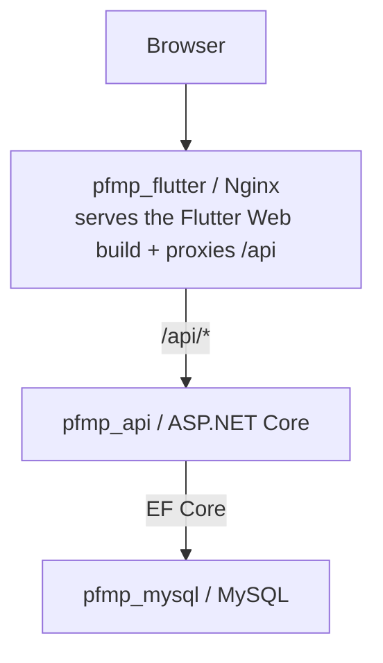

# 02 - Architecture

## Overview

```text
Browser
  |
  v
Flutter Web / Nginx
  |
  | /api
  v
ASP.NET Core API
  |
  v
MySQL
```

PFMP Manager is split into three main layers:

| Layer | Folder/service | Role |
| --- | --- | --- |
| Frontend | `appli_pfmp` / `pfmp_flutter` | Flutter Web interface served by Nginx. |
| Backend | `PFMPManager.Api` / `pfmp_api` | REST API, authentication, business rules, and database access. |
| Data | MySQL / `pfmp_mysql` | Stores users, roles, PFMPs, attendance, logbooks, messages, etc. |

## Backend architecture

The ASP.NET Core backend exposes controllers under `PFMPManager.Api/Controllers`.

Typical internal flow:

```text
Controller
  |
  | Request/response DTO
  v
Service or helper, where present
  |
  v
AppDbContext (EF Core)
  |
  v
MySQL
```

Key services:

- `RoleService`: determines the application role from the `Etudiant`, `Referent`, and `Administrateur` tables.
- `CurrentUserService`: extracts the user id and role from the JWT claims.
- `PfmpAccessService`: restricts a student's PFMP access to themselves or their assigned teacher/referent.
- `PlanningValidationService`: validates the days, time slots, and weekly total of a schedule.

## Frontend architecture

The Flutter frontend is organized around:

- `lib/application`: screens;
- `lib/data`: HTTP calls to `/api/...`;
- `lib/bloc`: state management with BLoC;
- `lib/model`: Dart models;
- `lib/custom`: shared widgets and helper functions.

API calls use `BrowserClient()..withCredentials = true`, which lets the browser send HttpOnly cookies along with requests.

## Docker architecture

Services in `docker-compose.yml`:

| Compose service | Container | Description |
| --- | --- | --- |
| `mysql` | `pfmp_mysql` | MySQL 8 with a persistent volume. |
| `api` | `pfmp_api` | ASP.NET Core API published in release mode, internal port 8080. |
| `flutter_web` | `pfmp_flutter` | Flutter Web build served by Nginx, internal port 80. |

The MySQL volume is external:

```yaml
volumes:
  mysql_data:
    external: true
    name: docker-test_mysql_data
```

It must exist before the first run:

```bash
docker volume create docker-test_mysql_data
```

## Nginx and the `/api` reverse proxy

`appli_pfmp/nginx.conf` serves the Flutter files and contains:

```nginx
location /api/ {
    proxy_pass http://api:8080/api/;
}
```

Thanks to this proxy, Flutter can call `/api/login`, `/api/dashboard`, etc. on the same origin as the web page. This avoids exposing the API directly to the browser in production-style mode.

For the full detail of `nginx.conf` (SPA fallback, asset caching, proxy headers), see [Nginx reverse proxy](NGINX_PROXY.md).

## Development

In Docker development:

```text
http://localhost:${FLUTTER_PORT}
  -> pfmp_flutter / Nginx
  -> /api proxied to pfmp_api:8080
  -> pfmp_mysql:3306
```

`docker-compose.override.yml` also exposes the API and MySQL:

- `${API_PORT}:8080`;
- `${MYSQL_PORT}:3306`;
- `${FLUTTER_PORT}:80`.

In development outside Docker, note: Flutter URLs are relative (`/api/...`). You therefore need to check or add a local proxy if Flutter is launched directly with `flutter run -d chrome`.

## Local production-style

`docker-compose.prod.yml` only exposes:

```yaml
flutter_web:
  ports:
    - "80:80"
```

The API and MySQL stay internal to the Docker network. This is the right model for a temporary public test: expose Nginx, not MySQL, and not the API directly.

## Mermaid diagram


