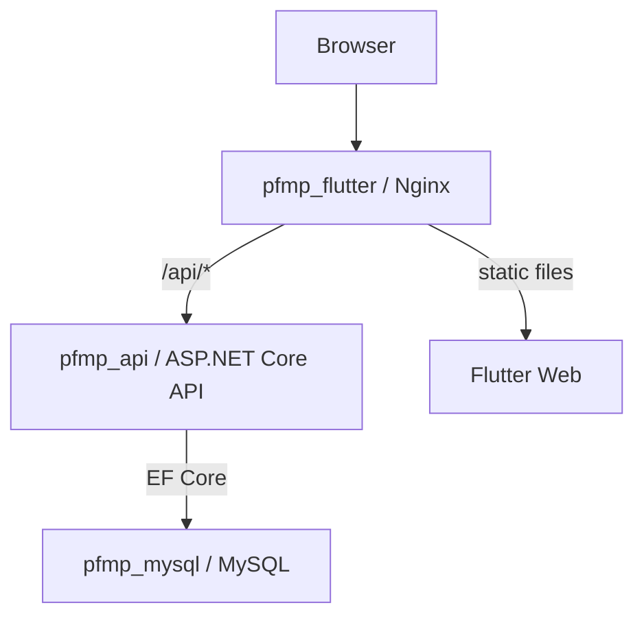

# 02 - Architecture

## Global Architecture

```text
Browser
  |
  v
Flutter Web / Nginx
  |
  | /api
  v
ASP.NET Core API
  |
  v
MySQL
```

PFMP Manager is split into three main layers:

| Layer | Folder or service | Responsibility |
| --- | --- | --- |
| Frontend | `appli_pfmp` / `pfmp_flutter` | User interface and browser experience. |
| Backend | `PFMPManager.Api` / `pfmp_api` | Authentication, authorization, business rules, and API responses. |
| Database | MySQL / `pfmp_mysql` | Persistent application data. |

## Why This Architecture Was Chosen

The separated architecture makes the project easier to understand, test, and evolve.

### Why separate frontend, backend, and database?

Each layer has a clear responsibility:

- the frontend focuses on screens, navigation, forms, loading states, and user experience;
- the backend owns sensitive logic such as authentication, role checks, PFMP access rules, attendance rules, schedule validation, and API responses;
- the database stores long-lived data such as users, PFMPs, attendance, daily reports, messages, organisations, and establishments.

This separation also avoids putting business or security rules directly in the browser.

### Why ASP.NET Core API?

ASP.NET Core is a good fit for this backend because it provides:

- controller-based REST endpoints;
- built-in authentication and authorization middleware;
- strong integration with JWT bearer validation;
- dependency injection for services such as `RoleService`, `CurrentUserService`, and `PlanningValidationService`;
- Entity Framework Core integration for MySQL access.

### Why Flutter Web?

Flutter Web lets the same UI framework manage the student and administrator screens with reusable widgets and BLoC state management. In this project, it is used for responsive web screens, forms, dashboards, messaging views, and admin supervision.

### Why MySQL?

The project has relational data: users, role profile tables, PFMPs, schedules, establishments, class groups, organisations, attendance rows, daily reports, and messages. MySQL fits this structure and is already configured through EF Core and the Docker Compose service `pfmp_mysql`.

### Why Docker Compose?

Docker Compose runs the frontend, backend, and database together with one command:

```bash
docker compose up --build
```

This makes the project easier to start on another machine, because developers do not need to manually wire every service, port, and connection string.

### Why Nginx in front of Flutter Web?

Nginx serves the compiled Flutter Web files and provides a stable HTTP entry point. It also handles the single-page app fallback by returning `index.html` for Flutter routes.

### Why use the `/api` reverse proxy?

The Flutter frontend calls `/api/...` instead of calling the backend host and port directly. Nginx forwards those requests to `http://api:8080/api/...` inside Docker.

Benefits:

- the browser talks to one origin;
- cookies stay scoped to the same origin;
- CORS is simpler for Dockerized frontend traffic;
- the API service port does not need to be public in production-style mode.

### Why keep the API internal in production-style mode?

In production-style mode, only Nginx is exposed on port 80. The API stays on the Docker network and is reached through the Nginx `/api` proxy. This reduces the public attack surface because users cannot directly access the API container port.

### Why keep MySQL internal?

MySQL contains application data and should never be exposed publicly. The API is the only component that should access the database. Public MySQL exposure would add unnecessary risk.

### Why environment variables and `.env.example`?

Environment variables allow local and Docker configuration to change without editing source code. `.env.example` provides a safe template without real secrets. The real `.env` must stay local and must not be committed.

### Why JWT in HttpOnly cookies?

The API stores the JWT access token in an HttpOnly cookie. This prevents Flutter/JavaScript from reading the token directly and lets the browser send it automatically with credentialed requests. The project also binds the JWT to a fingerprint cookie.

### Why separate development and production-style Docker configs?

Development mode exposes useful ports for debugging: Flutter, API, and MySQL. Production-style mode exposes only the public frontend/Nginx entry point. This keeps local development convenient while modeling a safer deployment shape.

## Backend Architecture

Typical backend flow:

```text
Controller
  |
  | DTO request/response
  v
Service or helper when present
  |
  v
AppDbContext / EF Core
  |
  v
MySQL
```

Important services:

- `RoleService`: resolves the application role from role-specific tables.
- `CurrentUserService`: extracts user id and role from JWT claims.
- `PfmpAccessService`: restricts PFMP access to the student or assigned teacher/referent.
- `PlanningValidationService`: validates schedule days, time slots, and weekly totals.

## Frontend Architecture

The Flutter app is organized around:

- `lib/application`: screens;
- `lib/data`: HTTP calls to `/api/...`;
- `lib/bloc`: BLoC state management;
- `lib/model`: Dart models;
- `lib/custom`: shared widgets and helpers.

API calls use `BrowserClient()..withCredentials = true`, allowing the browser to include HttpOnly cookies.

## Docker Architecture

| Compose service | Container | Description |
| --- | --- | --- |
| `mysql` | `pfmp_mysql` | MySQL 8 database with persistent external volume. |
| `api` | `pfmp_api` | ASP.NET Core API listening on internal port 8080. |
| `flutter_web` | `pfmp_flutter` | Flutter Web build served by Nginx on internal port 80. |

Services communicate by Docker Compose service names:

- the API connects to MySQL using `server=mysql;port=3306`;
- Nginx proxies API traffic to `http://api:8080/api/`.

## Nginx `/api` Reverse Proxy

`appli_pfmp/nginx.conf` contains:

```nginx
location /api/ {
    proxy_pass http://api:8080/api/;
}
```

This is the bridge between the browser-facing frontend and the internal backend container.

## Development Architecture

Development Docker mode exposes:

- Flutter/Nginx on `${FLUTTER_PORT}`;
- API on `${API_PORT}`;
- MySQL on `${MYSQL_PORT}`.

This is useful for debugging, direct API checks, and database inspection.

## Production-Style Architecture

`docker-compose.prod.yml` exposes only:

```yaml
flutter_web:
  ports:
    - "80:80"
```

The API and MySQL stay internal. This is the recommended shape for temporary public testing and a safer model for a future deployment.

## Mermaid Diagram


