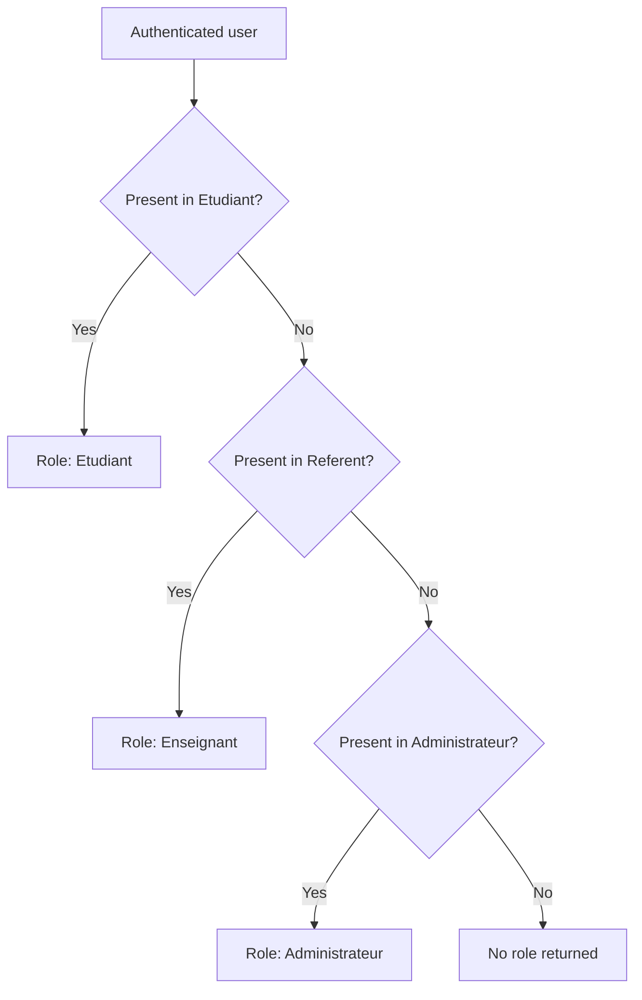

# 03 - Roles and permissions

Application roles are resolved by `RoleService`:

1. If the user is in `Etudiant`, role `Etudiant`.
2. Otherwise, if they are in `Referent`, role `Enseignant`.
3. Otherwise, if they are in `Administrateur`, role `Administrateur`.
4. Otherwise, no role is returned.

The `Professionnel` role exists in the data model, but it is never returned by `RoleService` (see "Professional / Workplace supervisor" below).

## Important rule for teacher/referent

A teacher/referent should only follow the students assigned to them.

In the current code, this assignment is checked using the `Etudiant` table:

- `Etudiant.Id_Utilisateur` corresponds to the referent;
- `Etudiant.Id_Utilisateur_1` corresponds to the student.

A teacher is not an administrator. They do not officially validate PFMPs in the current code. They can only access endpoints where the `Enseignant` role is authorized and where the student is linked to them.

## Permission table

| Function | Student | Teacher / Referent | Administrator | Professional |
| --- | --- | --- | --- | --- |
| Log in | Yes | Yes, backend only | Yes | No |
| Dedicated Flutter area | Yes | Not wired up yet | Yes | No |
| View their own dashboard | Yes | No | No | No |
| View their PFMPs | Yes, only their own | Yes, assigned students | Via admin endpoints | No |
| Create a complete PFMP | Yes | No | No | No |
| Manage their applications | Yes | No | No | No |
| Fill in their logbook | Yes | No | No | No |
| Export their logbook (PDF / JSON) | Yes, only their own PFMPs | No, in the current code | No, in the current code | No |
| Read/send PFMP messages | Yes, their active PFMPs | Yes, active PFMPs of assigned students | Yes, active PFMPs visible via their schools | No |
| Initialize attendance | No | No | Yes | No |
| Edit attendance | No | Yes, for an assigned student and a date within the PFMP | Yes, for a PFMP tied to the admin and a date within the PFMP | No |
| View admin statistics | No | No | Yes | No |
| Create a base user account | No | No | Yes | No |

> The "Professional" column is entirely *No*: see the detailed justification at the end of this file — no login mechanism for this role was found in the code inspected.

## Details by role

### Student

A student can:

- access their Flutter area;
- view their PFMPs via `/api/pfmp/recherche/{studentId}`;
- create a PFMP via `/api/pfmp/complete`;
- create and edit their applications;
- create and view their daily logbook entries;
- check whether today's logbook entry already exists;
- export their reports (PDF, and JSON on the backend);
- use messaging on their active PFMP.

Limits:

- cannot read another student's PFMPs;
- cannot access administrator endpoints;
- cannot initialize or edit attendance.

### Teacher / Referent

On the backend, a teacher can:

- read the PFMPs of an assigned student;
- read/send messages on an active PFMP of an assigned student;
- edit the attendance of an assigned student for a date covered by their PFMP.

Limits:

- no dedicated Flutter interface wired into `main.dart`;
- no admin access;
- cannot create a PFMP;
- no official PFMP validation visible in the code;
- no dedicated `/api/referent/...` endpoint in the current controllers.

### Administrator

An administrator can:

- open the Flutter admin area;
- view PFMPs for students in their schools;
- filter trainees by name, company, status, or class;
- view per-class statistics;
- initialize the day's attendance;
- edit attendance for PFMPs they administer;
- use admin messaging on visible active PFMPs;
- create a base user account via `/api/utilisateur`.

Limits:

- creating via `/api/utilisateur` does not automatically create a role profile;
- the scope of admin attendance access uses `Pfmp.Id_Utilisateur == adminId`;
- an admin cannot, through the current endpoints, generate a student's logbook PDF, because the `pdf` action effectively restricts access to the student who owns the PFMP.

### Professional / Workplace supervisor

The professional is modeled by:

- `Professionnel`;
- `Travailler`;
- `Utilisateur`, created or found while a PFMP is being created.

But:

- `RoleService` never returns `Professionnel`;
- no controller declares `[Authorize(Roles = "Professionnel")]`;
- no professional-facing Flutter interface is visible.

Conclusion: this role only exists in the business model in the current version; it does not log into the application. That is why the permission table above shows *No* across the entire "Professional" column rather than "not confirmed" — the three points above, taken together, confirm the absence of a login path rather than mere uncertainty.
