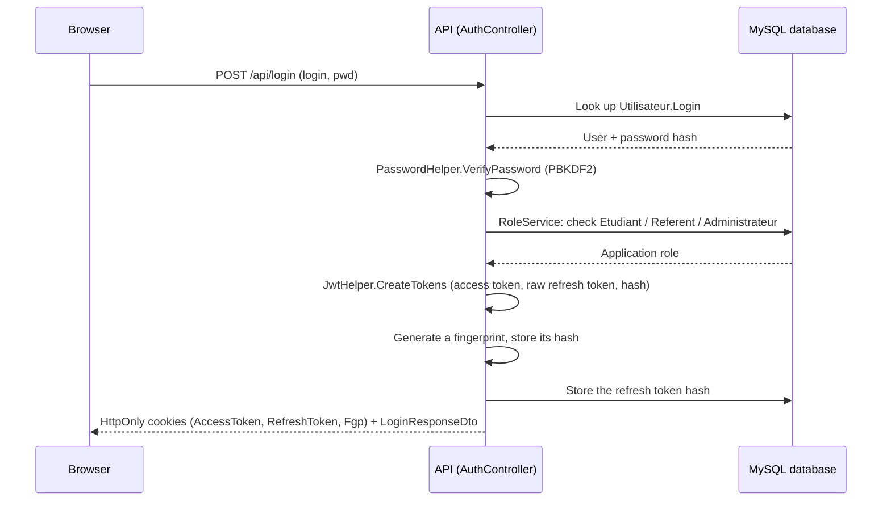

# 07 - Authentication and security

## Summary

PFMP Manager uses JWT authentication with HttpOnly cookies:

- `AccessToken`: short-lived JWT;
- `RefreshToken`: long-lived token, only ever raw in the browser, hashed in the database;
- `Fgp`: session fingerprint.

The frontend never reads the JWT. It calls the API with `BrowserClient()..withCredentials = true`, and the browser sends the cookies automatically.

## Login

Endpoint:

```text
POST /api/login
```

Flow:

1. The frontend sends `login` and `pwd`.
2. The API looks up `Utilisateur.Login`.
3. `PasswordHelper.VerifyPassword` checks the PBKDF2 hash.
4. `RoleService` determines the role.
5. `JwtHelper.CreateTokens` creates:
   - a JWT access token;
   - a raw refresh token;
   - the refresh token's hash.
6. The API generates a fingerprint and stores its hash.
7. The API sets the HttpOnly cookies.
8. The API returns `LoginResponseDto`.



## Password

`PasswordHelper` uses:

- PBKDF2 with SHA-256;
- a random 16-byte salt;
- a 48-byte hash;
- 100,000 iterations;
- salt + hash stored together, Base64-encoded.

## JWT

`JwtHelper` places the following in the JWT:

- `ClaimTypes.NameIdentifier`: user id;
- `ClaimTypes.Role`: role;
- `ClaimTypes.Name`: login;
- `fingerprint_hash`: hash of the `Fgp` cookie.

Validation in `Program.cs`:

- valid issuer;
- valid audience;
- valid lifetime;
- valid signing key;
- `ClockSkew = TimeSpan.Zero`;
- the JWT is read from the `AccessToken` cookie;
- the hash of the `Fgp` cookie is compared against the `fingerprint_hash` claim.

## Refresh token

The refresh token:

- is randomly generated;
- is sent in an HttpOnly cookie;
- is stored hashed in the database;
- expires after 7 days in the current code;
- is replaced on every refresh;
- belongs to a `TokenFamilyId`.

If an already-revoked refresh token is reused, the whole family is revoked.

## Cookies

Cookies set:

| Cookie | HttpOnly | Current Secure | SameSite | Current duration |
| --- | --- | --- | --- | --- |
| `AccessToken` | Yes | `false` | `Strict` | 15 minutes |
| `RefreshToken` | Yes | `false` | `Strict` | 7 days |
| `Fgp` | Yes | `false` | `Strict` | 7 days |

`Secure = false` is only appropriate for local HTTP development. In an HTTPS production environment, this needs to switch to `Secure = true`.

## Role-based authorization

Roles are checked with `[Authorize]` and `[Authorize(Roles = "...")]`.

Examples:

- `Administrateur`: `/api/administrateur`, `/api/presence/initialiser`, `/api/utilisateur`;
- `Etudiant`: `/api/dashboard`, `/api/demarches`, `/api/journal`, `/api/pfmp/complete`;
- `Etudiant,Enseignant`: `/api/pfmp/recherche/{studentId}/{pfmpId?}`;
- `Enseignant,Administrateur`: `/api/presence/update/{studentId}`.

Some `[Authorize]` actions (with no role specified) have additional internal business checks — for example, messaging.

## CORS

`Program.cs` declares an `AllowFlutterWeb` policy with:

```text
http://localhost:65427
```

and:

- `AllowAnyMethod`;
- `AllowAnyHeader`;
- `AllowCredentials`.

Important:

- for requests that carry cookies, exact origins must be listed explicitly;
- never combine `AllowAnyOrigin()` with `AllowCredentials()`;
- in Docker via Nginx, `/api` calls are same-origin, so CORS is less critical for the frontend served by Nginx. Exactly which scenario relies on this policy (for example, running `flutter run` outside Docker on port `65427`) is not confirmed in the files reviewed — to verify.

## Nginx and `/api`

`appli_pfmp/nginx.conf` serves Flutter and proxies:

```text
/api/* -> http://api:8080/api/*
```

Benefits:

- no need to expose the API directly to the browser in production-style mode;
- cookies stay on the same origin as the application;
- fewer CORS issues.

Full details of `nginx.conf`: [Nginx reverse proxy](NGINX_PROXY.md).

## Secrets

Rules:

- never commit `.env`;
- use `.env.example` only as a template;
- replace `JWT_SECRET` with a long, random value;
- never document real local values.

The repository ignores `.env` via `.gitignore`.

## Risks and security TODOs

| Topic | Risk | Recommendation |
| --- | --- | --- |
| `Secure=false` cookies | Cookies sent over plain HTTP | Switch to `Secure=true` for HTTPS production. |
| HTTPS | No complete production configuration visible | Terminate TLS via a reverse proxy or hosting provider. |
| Forwarded headers | `UseHttpsRedirection` exists, but no forwarded-headers middleware is visible | Add `UseForwardedHeaders` behind Nginx if needed. |
| Direct API access | `docker-compose.override.yml` exposes the API in dev | Do not expose the API directly in production-style mode. |
| MySQL | MySQL exposed in dev only | Never expose MySQL publicly. |
| API database user | The API uses `${MYSQL_USER}`/`${MYSQL_PASSWORD}`, but the MySQL service does not create this user in the current compose file | Verify user creation for a fresh volume. |
| Workplace supervisor | Creates a user with a temporary password of `test1234` | Remove this behavior before production. |
| Profile | Profile endpoint incomplete | Finalize `[Authorize]` and explicit routes. |
| Tests | No visible automated security tests | Add tests for auth, roles, cross-user access, and refresh tokens. |
| DataProtection | No visible key-ring persistence | To verify whether any cookies/ASP.NET protections depend on this in production. |

## Production best practices

- Enable HTTPS.
- Use strong secrets, kept out of Git.
- Do not expose MySQL.
- Do not expose the API directly if Nginx can proxy `/api`.
- Use an application-level MySQL user with limited privileges.
- Set up backups and a tested restore procedure.
- Add structured logs and alerting.
- Test 401/403 responses for every role.
